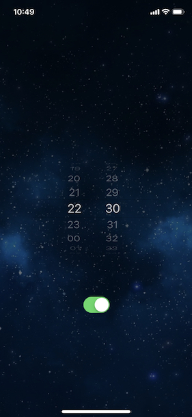
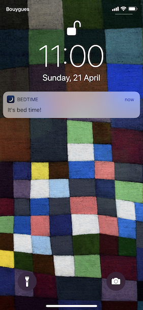

Bedtime is a very simple single-page app written in Swift, that sets up a notification with a custom sound. The notification is fired at a certain time, every day unless turned off in the app. The jingle sound used here was created by my son in Logic Pro.

